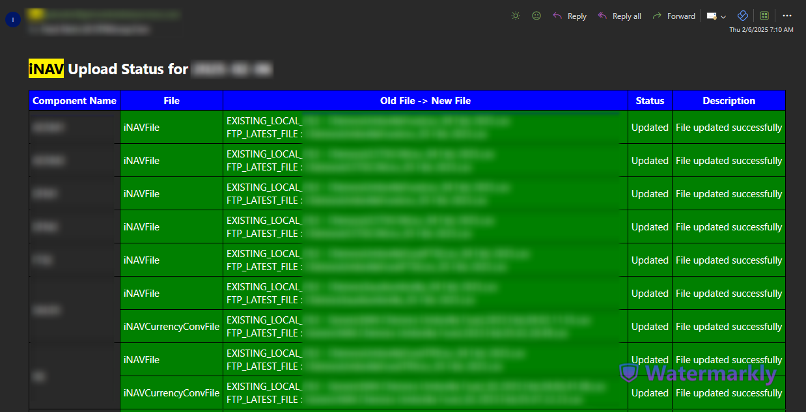

# FTP File Downloader

## Overview

The **FTP File Downloader** is a Python script designed to download, update, and validate FTP files. It processes CSV files, checks for differences with local files, and updates them if needed. It also performs ISIN validation based on a configuration file, handles file backup, and sends an email notification about the update status.

## Features

- Downloads the latest FTP file based on a given pattern.
- Compares the downloaded file with an existing local file.
- Backs up the existing local file before updating.
- Validates ISIN values within the file.
- Logs all actions with configurable retention and rotation policies.
- Sends an email notification with the update status.

## Prerequisites

- Python 3.9+
- Unix-based operating system
- Required Python packages:
  - `python-dotenv`
  - `loguru` (logging)
  - `pandas`
  - `numpy`
  - `pytz`
  - `dateutil`

## Configuration

### File Structure

```bash
├── ftp_file_downloader.py    # Main script for monitoring FTP downloads
├── send_mail.py              # Sends email notifications
├── table_create.py           # Manages database table creation
├── config/                   # Configuration files for different weekdays
│   ├── monday ── config.ini  # Monday's task configuration
│   └── other-weekdays ── config.ini  # Other weekdays' task configurations
└── logs/                     # Auto-rotated logs storage
```

### config.ini Structure

```ini
[component1]
iNAVFile = /path/to/ftp/directory
component_path = /path/to/local/component
tag = component1_tag
iNAVFilePattern = file_pattern_to_match

[iNAVCurrencyConvFile]
iNAVCurrencyConvFile = /path/to/ftp/directory
component_path = /path/to/local/component
tag = currency_conv_file_tag
iNAVCurrencyConvFilePattern = file_pattern_to_match
```

### .env Structure

```bash
FTP_IP=<your_ftp_server_ip>
FTP_USERNAME=<your_ftp_username>
FTP_PASSWORD=<your_ftp_password>
USERNAME=<your_email_username>
PASSWORD=<your_email_password>
```

## Example Email


